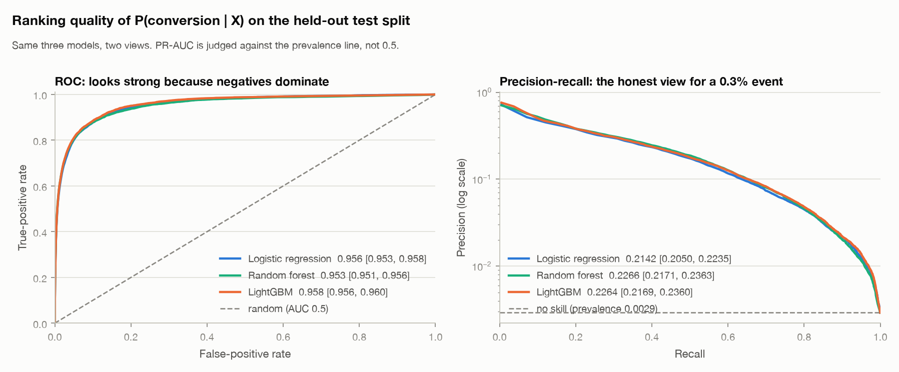
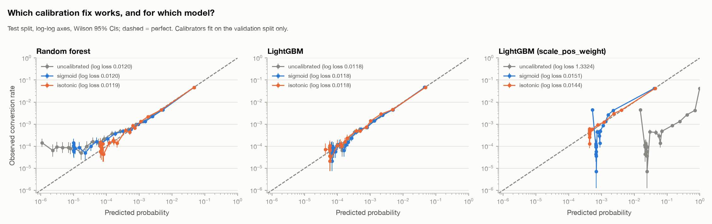
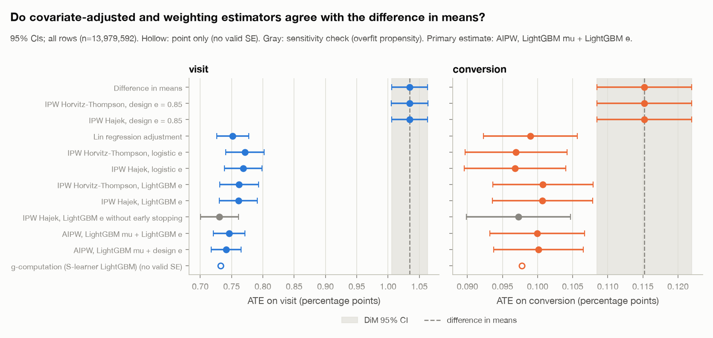
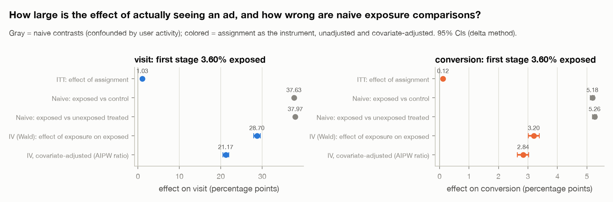
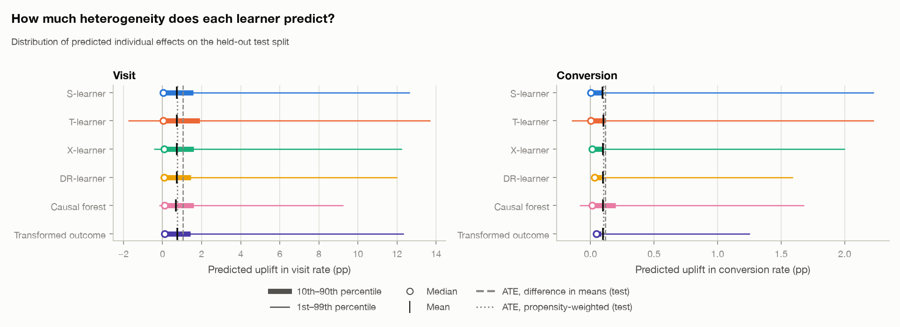
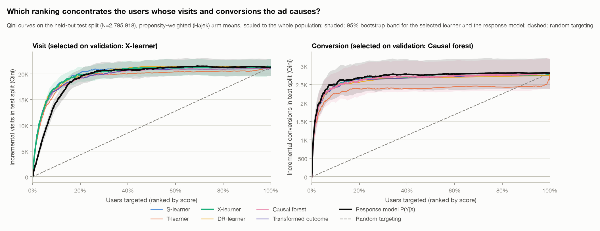
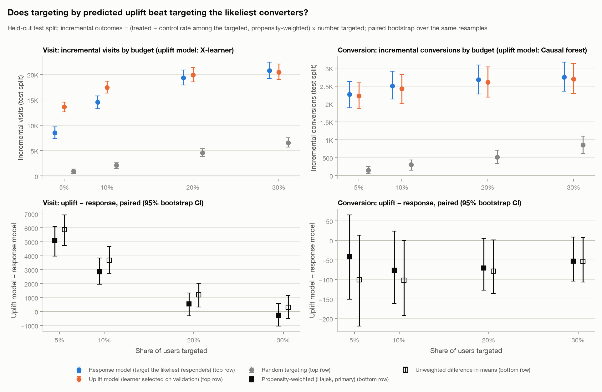
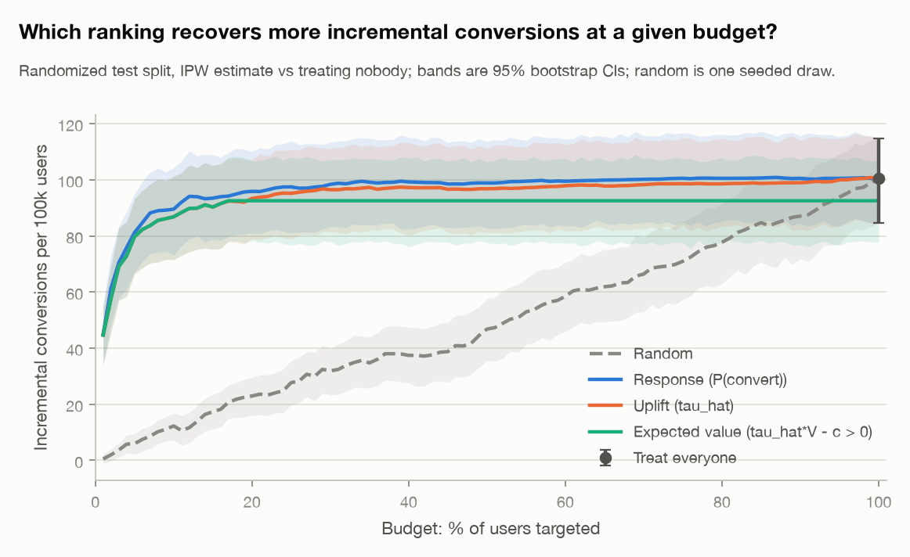
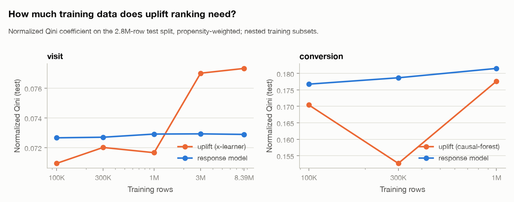

# CausalML on the Criteo Uplift dataset

**Can we identify users who convert *because of* an ad, rather than users who would have converted anyway?**

This repository works through the full classical statistical-ML workflow on 13,979,592 users from Criteo's randomized
advertising incrementality tests:

- exploratory analysis and hypothesis tests
- predictive models of P(conversion | X), with calibration and interpretation
- average-treatment-effect estimators and propensity scores
- heterogeneous-effect (CATE) and uplift models
- a budget-constrained targeting optimizer

The central experiment compares targeting the users most likely to convert against targeting the users whose
behaviour the ad changes most. Every number below is read from `results/` and was produced by `make all` on the full
dataset. No LLMs, embeddings or generative models are used anywhere.

## Key findings

1. **Randomization is imperfect in the pooled benchmark, and it matters.** Treatment is weakly predictable from the
   features:
   - classifier two-sample test AUC 0.509 [0.508, 0.510], permutation p = 0.001; joint likelihood-ratio test
     p = 2e-53;
   - the imbalance is correlated with the outcomes.

   Covariate-adjusted estimators (Lin regression, IPW, doubly robust AIPW, g-computation) agree with each other and sit
   well below the raw treated-vs-control difference:

   | Outcome | Raw difference | Doubly robust (AIPW) | Reduction |
   |---|---|---|---|
   | Visit | +1.034 pp | **+0.746 pp** [0.721, 0.771] | 28% |
   | Conversion | +0.115 pp | **+0.100 pp** [0.093, 0.107] | 13% |
2. **Assignment is not exposure.** Only 3.6% of ad-eligible users were actually shown an ad. The naive
   exposed-vs-control contrast (+37.6 pp visits) is confounded by user activity. Using randomized assignment as an
   instrument, the covariate-adjusted effect of actually seeing an ad is **+21.2 pp [20.5, 21.9] on visits** and
   **+2.84 pp [2.65, 3.03] on conversions** among exposed users.
3. **For visits, uplift targeting beats probability targeting at small budgets.** At a 5% budget, the X-learner
   finds **13,624 [12,612, 14,555] incremental visits** on the 2.8M-user test split, against 8,542 [7,418, 9,674] for
   ranking by visit probability: **+5,083 [3,960, 6,098], about +60%**.
   - Of the visits in the response model's top 5%, 88% would have happened without the ad (73% for the uplift model's
     top 5%).
   - The advantage is still clear at 10% (+2,862 [1,953, 3,840]) and disappears at 20–30%.
   - It is stable across seeds (+2,893 ± 144 at 10%).
   - The uplift model needs ≥ 3M training rows to pass the response model.
4. **For conversions, it does not.** No uplift learner beats ranking by conversion probability, at any budget or on
   the Qini coefficient; the causal forest is significantly *worse* on Qini. The share of conversions that would have
   happened anyway is flat (about 67%) across score groups. The ad lifts conversion roughly in proportion to baseline
   propensity, so the likeliest converters are also the most incremental.
5. **Targeting still pays.** Treating the top 10% by conversion probability yields 89.5 [73.1, 104.3] incremental
   conversions per 100K users, against 100.4 [84.6, 114.7] for treating everyone. That is ~89% of the lift at a tenth
   of the treatment volume. At a cost/value ratio of 0.001, blanket treatment nets about $22 per 100K users, while
   response targeting at an 11% budget (chosen on validation) nets $4,051 [3,330, 4,777].

The honest answer to the research question: *yes for visits, where the likeliest visitors are mostly "sure things";
no for conversions, where the signal is too sparse and the effect scales with the baseline.* This matches the dataset
authors' advice to model uplift on visits.

## Dataset

- Kaggle: <https://www.kaggle.com/datasets/arashnic/uplift-modeling> (`criteo-uplift-v2.1.csv`)
- Official source: <https://ailab.criteo.com/criteo-uplift-prediction-dataset/>
- Paper: Diemert et al., *A Large Scale Benchmark for Individual Treatment Effect Prediction and Uplift Modeling*,
  2021 ([arXiv:2111.10106](https://arxiv.org/abs/2111.10106)). CC BY-NC-SA 4.0.

The data merges several advertisers' incrementality tests; in each, a random share of users is held out from ad
targeting. Version 2.1 re-sampled every test to the same treatment ratio to remove a v1 leak. Rows were sub-sampled
non-uniformly for privacy, so rates describe this benchmark sample, not real-world ad incrementality. See
[`data/README.md`](data/README.md) for download instructions and the full column description.

| | |
|---|---|
| Users | 13,979,592 (split 60/20/20: 8.39M train, 2.80M validation, 2.80M test; stratified on T × visit × conversion) |
| Features | 12 anonymized: 4 continuous (`f0 f2 f7 f10`), 8 hashed categoricals with 60–3,743 levels |
| `treatment` | randomized ad eligibility; 85.0% treated |
| `exposure` | actually shown ≥ 1 ad; 3.60% of treated users, 0 of control (post-randomization, self-selected) |
| `visit` / `conversion` | 4.70% / 0.29% overall |

## Methodology

```text
Raw data (14.0M users)
    ↓  validation, stratified split, label-free feature builder          src/data, src/features
EDA + statistical analysis
    ↓  rates, balance, z-tests, exact bootstrap, C2ST, power             src/data/preprocess.py, src/causal/ate.py
Predictive ML: P(conversion | X)
    ↓  LR / random forest / LightGBM, stratified 5-fold CV               src/models
Probability calibration + interpretation
    ↓  Platt vs isotonic (fit on validation), coefficients, permutation, SHAP
Causal inference: ATE
    ↓  DiM, Lin, IPW, AIPW, g-computation, propensity, exposure IV       src/causal/ate.py, propensity.py
CATE / uplift modeling
    ↓  S/T/X/DR-learners, causal forest, Qini/AUUC, BLP, GATES           src/causal/learners.py, uplift_metrics.py
Policy optimization
    ↓  budgeted targeting, off-policy value with propensity weights      src/optimization/targeting.py
Robustness + scaling                                                     src/robustness.py, src/scaling.py
```

Protocol: features, calibrators, thresholds, hyperparameters and learner selection use only the train and validation
splits; the test split is used once for the reported numbers. Uncertainty comes from paired Poisson bootstraps over
test users (uplift, policies), influence functions (ATE estimators), and refits with new seeds and disjoint training
halves (robustness).

## Models

| Stage | Model | Target / estimand | Notes |
|---|---|---|---|
| Predictive | Logistic regression (L2) | P(conversion \| X) | interpretable baseline; linear design with one-hot + log-frequency encodings |
| Predictive | Random forest | P(conversion \| X) | 2M-row training sample, `min_samples_leaf` = 100 |
| Predictive | LightGBM | P(conversion \| X) | all 8.39M training rows, early stopping on validation |
| ATE | Difference in means | E[Y(1) − Y(0)] | valid only under full randomization |
| ATE | Lin (2013) regression adjustment | ATE | fully interacted OLS, HC2 standard errors |
| ATE | IPW (Horvitz-Thompson, Hajek) | ATE | design, logistic and LightGBM propensities, cross-fitted |
| ATE | AIPW (doubly robust) | ATE | cross-fitted LightGBM outcome and propensity models; **primary** |
| ATE | Wald IV, covariate-adjusted IV | effect of exposure on the exposed | assignment as instrument |
| CATE | S-, T-, X-, DR-learner | E[Y(1) − Y(0) \| X] | own implementations on LightGBM base learners |
| CATE | Causal forest (EconML `CausalForestDML`) | CATE | 1M-row training sample, honest splitting |
| CATE | Transformed outcome | CATE | Athey-Imbens class-variable transformation |

## Results

### Classical tests (raw difference in means, all 14M users)

| Outcome | Treated | Control | Difference [95% CI] | Relative lift | z |
|---|---|---|---|---|---|
| Visit | 4.854% | 3.820% | +1.034 pp [1.006, 1.063] | +27.1% [26.2, 28.0] | 65.3 |
| Conversion | 0.309% | 0.194% | +0.115 pp [0.108, 0.122] | +59.4% [54.4, 64.7] | 28.5 |

H0: p_T = p_C, rejected for both (p < 1e-170). Bootstrap CIs (2,000 exact binomial draws) match the Wald intervals.
These are the *naive* effects; the next table corrects them.

### Average treatment effect estimators (all 14M users, percentage points, 95% CI)

| Estimator | Visit | Conversion |
|---|---|---|
| Difference in means | 1.034 [1.006, 1.063] | 0.1152 [0.1085, 0.1219] |
| Lin regression adjustment | 0.752 [0.726, 0.777] | 0.0990 [0.0923, 0.1056] |
| IPW, Hajek, LightGBM propensity | 0.761 [0.731, 0.791] | 0.1007 [0.0935, 0.1079] |
| **AIPW (doubly robust)** | **0.746 [0.721, 0.771]** | **0.1000 [0.0932, 0.1067]** |
| g-computation (S-learner) | 0.733 | 0.0977 |

An observational demo makes a confounded dataset out of the experiment: users are dropped with a probability that
depends on a feature and on treatment, over 16 replicates.
- The naive difference then reads 2.19 pp for visits, with 0% CI coverage of the full-data AIPW answer.
- AIPW recovers 0.749 pp (coverage 88%), and Lin regression 0.748 pp.

### Predictive models (test split, 2.8M users, base rate 0.29%)

| Model | ROC-AUC | PR-AUC | Log loss | Brier | Mean predicted / base rate |
|---|---|---|---|---|---|
| Logistic regression | 0.956 [0.953, 0.958] | 0.214 [0.205, 0.224] | 0.01202 | 0.00253 | 1.00 |
| Random forest | 0.953 [0.951, 0.956] | 0.227 [0.217, 0.236] | 0.01204 | 0.00250 | 0.99 |
| **LightGBM** | **0.958 [0.956, 0.960]** | **0.226 [0.217, 0.236]** | **0.01181** | 0.00251 | 1.00 |
| LightGBM, `scale_pos_weight` = 342 | 0.873 | 0.044 | 1.332 | 0.086 | 51.1 |

- **Model comparison:** LightGBM beats logistic regression by a small but significant margin (paired bootstrap:
  ROC-AUC +0.0022 [0.0017, 0.0027], PR-AUC +0.012 [0.008, 0.016]) and ties the random forest on PR-AUC.
- **Calibration:** the unweighted models are already calibrated, and Platt/isotonic calibration changes log loss by
  at most 0.0001. Class weighting hurt ranking as well as calibration at a fixed tree budget.
- **Operating points:** flagging the top 1% of users catches 54% of converters at 15.7% precision (54× the base
  rate).
- **Duplicates:** 14% of test rows share a feature vector with a training row, but they contain only 32 of 8,155
  conversions; excluding them leaves the metrics unchanged.

### Uplift models (test split, propensity-weighted, 95% bootstrap CI)

Normalized Qini coefficient (area between the model's Qini curve and random targeting, divided by the area of a
perfect ranking):

| Scorer | Visit | Conversion |
|---|---|---|
| S-learner | 0.0777 [0.0723, 0.0836] | 0.1737 [0.1441, 0.2082] |
| T-learner | 0.0713 [0.0659, 0.0773] | 0.1339 [0.1040, 0.1640] |
| X-learner | 0.0773 [0.0718, 0.0842] | 0.1733 [0.1430, 0.2077] |
| DR-learner | 0.0781 [0.0721, 0.0846] | 0.1694 [0.1360, 0.2032] |
| Causal forest | 0.0740 [0.0689, 0.0803] | 0.1736 [0.1446, 0.2094] |
| Transformed outcome | 0.0745 [0.0685, 0.0803] | 0.1724 [0.1429, 0.2036] |
| Response model P(Y \| X) | 0.0729 [0.0671, 0.0793] | **0.1815 [0.1513, 0.2151]** |
| Random | −0.0006 | 0.0048 |

- **Qini differences vs the response model:** DR- and S-learner beat it on visit (+0.0052 [0.0022, 0.0082] and
  +0.0048 [0.0011, 0.0082]). Every learner ties or trails it on conversion (causal forest −0.0079 [−0.0132, −0.0030]).
- **Validity of the effect scores:** the BLP heterogeneity test (Chernozhukov et al.) finds real heterogeneity for
  every learner (p ≤ 2e-8). The S-learner's visit slope is 1.02 [0.95, 1.09], meaning well-calibrated effect scores.
- **Negative predictions are noise:** users predicted to be *hurt* by the ad (23% of users under the T-learner) have a
  positive observed effect (+0.13 pp [0.003, 0.26] on visits).

Incremental outcomes on the test split, **uplift minus response targeting**:

| Budget | Visit (X-learner) | Conversion (causal forest) |
|---|---|---|
| Top 5% | **+5,083 [3,960, 6,098]** | −42 [−151, 65] |
| Top 10% | **+2,862 [1,953, 3,840]** | −76 [−162, 24] |
| Top 20% | +545 [−303, 1,335] | −71 [−127, 5] |
| Top 30% | −258 [−1,040, 559] | −53 [−104, 9] |

### Targeting policies (conversion; illustrative value $50 per conversion, cost $0.05 per treated user)

Incremental conversions per 100K users, test split, propensity-weighted:

| Policy | 5% budget | 10% budget | 20% budget | Treat everyone |
|---|---|---|---|---|
| Random | 5.9 [2.2, 9.5] | 12.3 [7.2, 16.8] | 22.9 [16.1, 29.5] | 100.4 [84.6, 114.7] |
| Highest conversion probability | 81.2 [67.2, 95.1] | 89.5 [73.1, 104.3] | 95.9 [81.1, 110.0] | |
| Highest estimated uplift | 79.7 [66.5, 93.2] | 86.8 [71.5, 101.2] | 93.3 [78.9, 107.2] | |
| Highest expected value (τ̂·V − c > 0) | 79.7 | 86.8 | 92.5 (treats 16.7%) | |

Net value per 100K users, with the budget chosen on validation:

| Cost / value | Best policy | Its budget | Its net value | Treat-everyone net |
|---|---|---|---|---|
| 0.0002 | Response | 31% | $4,628 | $4,022 |
| 0.0010 | Response | 11% | $4,051 [3,330, 4,777] | $22 [−790, 758] |
| 0.0020 | Response | 6% | $3,634 | −$4,978 |
| 0.0050 | Response | 3% | $2,775 | −$19,978 |

### Robustness

| | Visit (X-learner) | Conversion (causal forest) |
|---|---|---|
| Uplift − response at 10%, over 3 seeds | +2,893 (SD 144), always positive | −78 (SD 14), always negative |
| τ̂ rank correlation between seeds | 0.98 | 0.49 |
| τ̂ rank correlation between disjoint training halves | 0.82 | 0.40 |
| Top-10% targeted-set overlap between halves (Jaccard) | 0.70 | 0.68 |

- **Visit learning curve:** the X-learner's Qini passes the response model's only with ≥ 3M training rows. That
  echoes the dataset paper's finding that uplift needs very large samples.
- **Pooled model within each arm:** the pooled conversion model ranks equally well in each randomized arm (ROC-AUC
  0.959 control, 0.958 treated). Because it never sees treatment, it over-predicts conversion within control by 38%
  and under-predicts within the treated arm by 4%.

### Scaling (12 threads, Apple M4 Pro, 48 GB)

| Model | Training rows | Fit | Predict per 1M rows | Peak memory | Test PR-AUC |
|---|---|---|---|---|---|
| Logistic regression | 8.39M | 7.5 s | 0.17 s | 18.4 GB | 0.214 |
| LightGBM (300 trees) | 8.39M | 18.5 s | 0.94 s | 7.9 GB | 0.224 |

LightGBM overtakes logistic regression on PR-AUC only above ~3M training rows. The full pipeline
(`make all`) takes about 1.5–2 hours on this machine; the development mode (`MODE=dev`, 5% sample) takes minutes.

## Visualizations

**Precision-recall is the honest view of a 0.3% event.** ROC-AUC looks strong only because negatives dominate.


**Calibration.** Calibrators are fit on validation and evaluated on test.


**Every covariate-adjusted estimator disagrees with the raw difference in means.**


**Effect of actually seeing an ad, versus naive exposure comparisons.**


**Distribution of estimated treatment effects by learner.**


**Qini curves on the 2.8M-user test split.**


**The central experiment: uplift vs conversion-probability targeting.**


**Targeting policies by budget.**


**How much data uplift ranking needs.**


All 42 figures are in [`results/figures`](results/figures); the notebooks walk through them in order.

## Reproduce

```bash
# 1. environment (Python 3.12, uv; pip users: pip install -r requirements.txt && pip install -e .)
uv sync

# 2. data: downloads the Kaggle archive (~340 MB), validates, splits, writes parquet (~1 min)
make data

# 3. quick end-to-end pass on the 5% development sample (writes to results/dev/)
make all MODE=dev

# 4. full data, stage by stage (writes to results/)
make eda stats predict      # EDA, hypothesis tests, predictive models (~20 min)
make causal cate            # ATE estimators (~30 min), CATE/uplift (~30 min)
make targeting robustness scaling

# 5. tests and notebooks
make test                   # 88 unit tests on synthetic data (~30 s)
make notebooks              # executes notebooks/01-05 in place
```

Configuration (seeds, splits, sample sizes, model settings, business assumptions) lives in
[`configs/config.yaml`](configs/config.yaml). Every stage is `uv run causalml <stage> --mode dev|full`.

## Repository layout

```text
configs/config.yaml        every constant, seed and sample size
data/README.md             download instructions and column meanings (data itself is not committed)
notebooks/01-05            narrative notebooks that call src/ and read results/
src/data                   load.py (download, validate, split), preprocess.py (EDA computations)
src/features               label-free feature builder (tree and linear designs)
src/models                 baseline, tree models, calibration, evaluation, interpretation
src/causal                 ate.py, propensity.py, learners.py, causal_forest.py, uplift_metrics.py
src/optimization           targeting.py
src/robustness.py, src/scaling.py
src/visualization          one shared style, one plotting module per stage
results/{metrics,tables,figures}   full-data outputs (JSON, CSV, PNG)
tests/                     unit tests with known answers on synthetic data
```

## Limitations

- **The data is a benchmark, not a live system.** Non-uniform sub-sampling (including negative sampling on labels)
  means absolute rates and effects are not real-world ad incrementality, and the business values in the targeting
  stage are assumptions.
- **Adjustment has limits.** Treatment is only conditionally ignorable here, and the adjusted estimators assume the
  12 features capture the dependence between assignment and outcomes. If the sub-sampling depended on the outcomes
  themselves, no feature adjustment fully corrects it. The mechanism behind the imbalance (per-test pooling or
  label-dependent sampling) is a hypothesis, not verified.
- **Anonymized features.** They are randomly projected, so heterogeneity findings describe feature segments, not
  interpretable user types.
- **Exposure estimates rest on the exclusion restriction.** The IV estimates assume assignment affects outcomes only
  through ads shown.
- **Subsampled models.** The random forest, logistic regression and causal forest were trained on 1–2M-row samples
  for time; LightGBM and the meta-learners used all 8.39M training rows.

## Technical stack

Python 3.12 · uv · NumPy · pandas · PyArrow · scikit-learn · LightGBM · statsmodels · SciPy · EconML · SHAP ·
scikit-uplift (metric cross-checks) · Matplotlib · pytest · Jupyter
